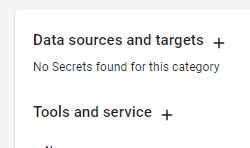
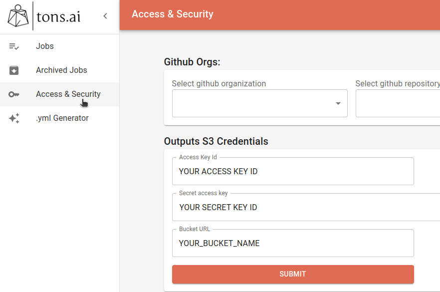

# hyperplane-client
a client-code facing library exposing internal APIs for the hyperplane platform

### On this page you can learn how to:
1. [Prepare Secrets for your code](#preparing-secrets-for-your-code)
1. [Get Secrets](#using-getsecret-in-your-program)
1. [Set Environment Parameters for your code](#setting-environment-parameters-for-your-code)
1. [Get Environment Parameters](#using-getenvparam-in-your-program)
1. [Create output files](#creating-output-files)
1. [Interact with S3](#awss3utils)
1. [Send logs and status reports back to the platform](#send-logs-and-status-reports-back-to-the-platform)
1. [Get User and Job Identifiers](#get-your-user-and-job-ids)


## Getting Secrets
### Preparing Secrets for your code
  Before you can consume any access keys or other secrets using our library, perform the following steps: 
#### Platform Run
  1. Log into the tons.ai platform 
  1. On the sidebar, click `Access & Security`
  1. Pick a relevant category for your secret (this is for your convenience only, so choose what makes sense for you) 
and click the `+` logo to the right of the category name

  
  1. Pick a `name` you would recognize for this secret (you cannot choose a name that is already in use by another one 
of your secrets)
  1. Type in the `value` for the secret in the relevant textbox. We will store this secret in our vault until you 
delete it.  


#### Local Run
  We will never access your secrets, so in order to simulate similar behaviour to a platform run locally, you are 
  required to provide some local copy of any relevant secrets. Local secrets may contain the same values as the ones in 
  our vault, but any value can be stored there. To provide a secret to a local run:
  1. Select a secret corresponding with the given `{secret_name}` value from the Hyperplane secret manager (set via 
the UI).
  1. Set the secret value from an environment variable named: `HYPERPLANE_SECRET_{secret_name}` (set using the 
`export`/`set` command), like so:

  ```shell
export HYPERPLANE_SECRET_my_secret_name="my_secret_value"
  ```

### Using `get_secret` in your program
Whether locally or in a platform run, the same code should to be used:  

```python
import hyperplane

secret_value = hyperplane.get_secret("secret_name")
print(f'my secret value for the key: secret_name is {secret_value}')
```

## Consuming Environment Parameters
### Setting environment parameters for your code
#### Platform Run
When composing your YAML file, add an `environment_params` section (note the indentation)
```yaml
main: ./my_train.py --epochs 3
environment_params:
  - SOME_ENVIRONMENT_PARAM: some env param value
  - SOME_OTHER_ENVIRONMENT_PARAM: Some_other_value1
```
our deployment pipeline wil set all these environment parameters for you, and clean them once your run has finished.

#### Local Run
Any environment parameter can be consumed using our code, you can set these parameters using the `set` or `export` 
commands, depending on your platform
  ```shell
export SOME_ENVIRONMENT_PARAM="some env param value"
export SOME_OTHER_ENVIRONMENT_PARAM="Some_other_value1"
  ```
 
### Using `get_env_param` in your program
Whether locally or in a platform run, the same code should to be used:  

```python
import hyperplane

env_param_value = hyperplane.get_env_param("env_param_name")
if env_param_value is not None:
    print(f'my environment includes a parameter called env_param_name with the value {env_param_value}')
else:
    print(f'could not find value for environment parameter called env_param_name')
```

## Creating Output Files
When your code is running on the tons.ai platform, stdout and stderr are automatically collected and uploaded to a 
dedicated directory. You can create additional files that will be uploaded at the end of your run 
using `print_to_file` like so:
```python
from hyperplane import print_to_file

out_file_name1 = "file1.txt"
print_to_file(out_file_name1, "some text payload")

# or

out_file_name2 = "file2.csv"
lines = [
  "line 1",
  "line 1 cont.\n",
  "line 2\n",
]
print_to_file(out_file_name2, *lines)
```

_Note: when running locally the files will be dumped to the Python current working directory_

### Dumping files directly to `OUTPUT_FILES_DIR_ABS`
Files can also be added by other means by placing them under the `OUTPUT_FILES_DIR_ABS` path. These files will be 
automatically uploaded to the platform for you to download later.

```python
# Save pytorch output model
out_file_path = os.path.join(hyperplane.OUTPUT_FILES_DIR_ABS, "model.ckpt")
trainer.save_checkpoint(out_file_path)
```

## aws_s3_utils
### Local run
First, set your 3 secrets: bucket name, access key and secret key as environment variables. 
Can be done anyway, for example in your bash run script:
  ```shell
export HYPERPLANE_SECRET_s3_bucket_name="my_aws_bucket_name"
export HYPERPLANE_SECRET_s3_access_key_secret="my_aws_access_key_secret"
export HYPERPLANE_SECRET_s3_access_key_id="my_aws_access_key_id"
  ```

  #### Download a single file from s3 to your local machine:
  ```python
from hyperplane.aws_s3_utils import download_from_s3

source_path_in_s3 = 'my-bucket-dir-1/file-name-in-s3-1.data'
download_from_s3(source_path=source_path_in_s3) # download to current workdir 

# or 

source_path_in_s3 = 'my-bucket-dir-1/file-name-in-s3-1.data'
target_path = './my-local-dir-1/file-name-in-my-computer-1.data'
download_from_s3(source_path=source_path_in_s3, target_path=target_path) # download to a specific path
      
  ```
  #### Upload a single file to s3 from your local machine:
  ```python
from hyperplane.aws_s3_utils import upload_to_s3

source_path_in_my_computer = './my-local-dir-1/file-name-in-my-computer-1.data'
file_path_in_s3 = upload_to_s3(source_path=source_path_in_my_computer) # upload file to the bucket directly

# or

source_path_in_my_computer = './my-local-dir-1/file-name-in-my-computer-1.data'
target_path = 'my-bucket-dir-1/file-name-in-s3-1.data'
file_path_in_s3 = upload_to_s3(source_path=source_path_in_my_computer, target_path=target_path) # upload to a specific bucket dir
  ```

_Note: see how to use filters to download/upload only some files from a directory 
[here](#upload-a-filtered-set-of-files-from-a-job-server-directory-to-s3-)_
### Platform run
  First set s3 related secrets in the UI

  
  #### Download a filtered set of files from s3 to a *job server* directory:
  ```python
from hyperplane.aws_s3_utils import download_from_s3

source_path_in_s3 = 'my-bucket-dir-2/'  # when downloading a dir, path should end with '/'
target_path = './my-local-dir-2/'       # when downloading a dir, path should end with '/'
regex_filter = 'file_prefix_[0-9][0-9][0-9]' # file_prefix_100, file_prefix_123, file_prefix_754... 

download_from_s3(source_path=source_path_in_s3, target_path=target_path, regex_filter=regex_filter)
      
  ```
  #### Download a complete directory from s3 to a *job server* directory:
  ```python
from hyperplane.aws_s3_utils import download_from_s3

source_path_in_s3 = 'my-bucket-dir-2/'  # when downloading a dir, path should end with '/'
target_path = './my-server-dir-2/'       # when downloading a dir, path should end with '/'

download_from_s3(source_path=source_path_in_s3, target_path=target_path)
      
  ```
_Note: `download_from_s3(...)` will auto create any path you are trying to download into, you can disable this 
functionality by specifying `create_target_path=False` as an additional parameter_

  #### Upload a filtered set of files from a *job server* directory to s3:
  ```python
from hyperplane.aws_s3_utils import upload_to_s3

target_path = 'my-bucket-dir-2/'                  # when uploading a dir, path should end with '/'
source_path_in_my_server = './my-server-dir-2/'  # when uploading a dir, path should end with '/'
regex_filter = 'file_prefix_[0-9][0-9][0-9]' # file_prefix_100, file_prefix_123, file_prefix_754... 

file_paths = upload_to_s3(source_path=source_path_in_my_server, target_path=target_path, regex_filter=regex_filter)
      
  ```
  #### Upload complete directory from a *job server* directory to s3:
  ```python
from hyperplane.aws_s3_utils import upload_to_s3

target_path = 'my-bucket-dir-2/'                  # when uploading a dir, path should end with '/'
source_path_in_my_server = './my-server-dir-2/'  # when uploading a dir, path should end with '/'

file_paths = upload_to_s3(source_path=source_path_in_my_server, target_path=target_path)
      
  ```

### Interacting with the S3 secret triplet directly using get_s3_credentials
 
Another way to interact with the s3 secret triplet is directly via the `get_s3_credentials` function, which returns the 
triplet (both locally and on the platform) as a dictionary like so: 
```python
>>> import hyperplane
>>> hyperplane.get_s3_credentials()
{
        "access_key_id": "my_aws_access_key_id",
        "secret_access_key": "my_aws_access_key_secret",
        "bucket_url": "my_aws_bucket_name",
}
```

you can use these to directly interact with your S3 bucket through boto3 (or any other tool you perfer), without using 
the functions listed above.

## Send logs and status reports back to the platform
Alongside any other systems you may be using the tons.ai platform supplies you with an API for sending reports directly 
to it. These reports will show up in the UI in the job page under the job name when running on the platform, or be 
printed to stdout if running locally.

```python
from hyperplane import report

report("something important happened")
```


## Get your User and Job IDs
The tons.ai platform assigns each user, job and machine a unique identifier. A running job can access its own ID by 
calling `get_job_id`, and the ID for the invoking user by calling `get_user_id` (both returning a unique string value), 
like so:
```python
import hyperplane
job_id = hyperplane.get_job_id()
invoking_user_id = hyperplane.get_user_id()
print(f"Hi, I'm job {job_id} and I was created by user {invoking_user_id}")
```

__When running locally__: The system will try and fetch job_id and user_id values from the `HYPERPLANE_JOB_ID` and `HYPERPLANE_USER_ID` environment parameters respectfully (or `None` if not set)


